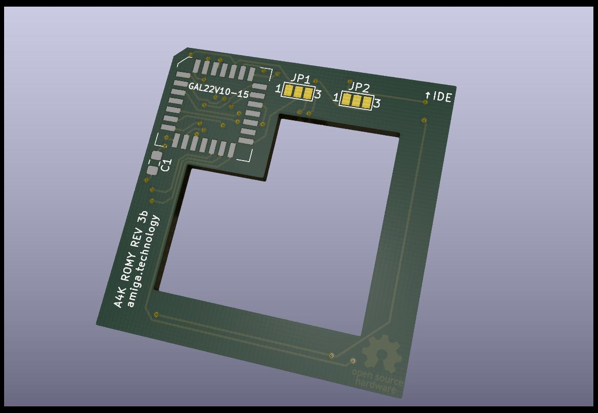
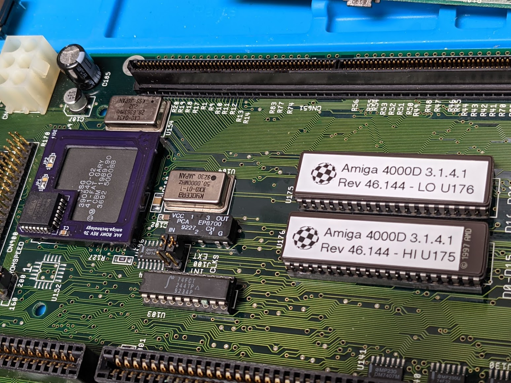

# Amiga Romy

ROMY is a small add-on PCB that enables Amiga 3000 / 4000 computers to use 1MB (or larger) Kickstart chips.

This project aims at iterating and improving the existing Romy designs.

# Hardware

In the `hardware` directory you will find the kicad schematics and PCB for the
latest version of "my" ROMY.

# Logic

The `logic` directory contains the contents for the GAL.

# Software

Look in the `software` directory for a bunch of scripts to create a nice 1MB ROM
image for you.

# What it looks like

# Credits

Romy has been developed in the past by speedgeek and Cosmos.
