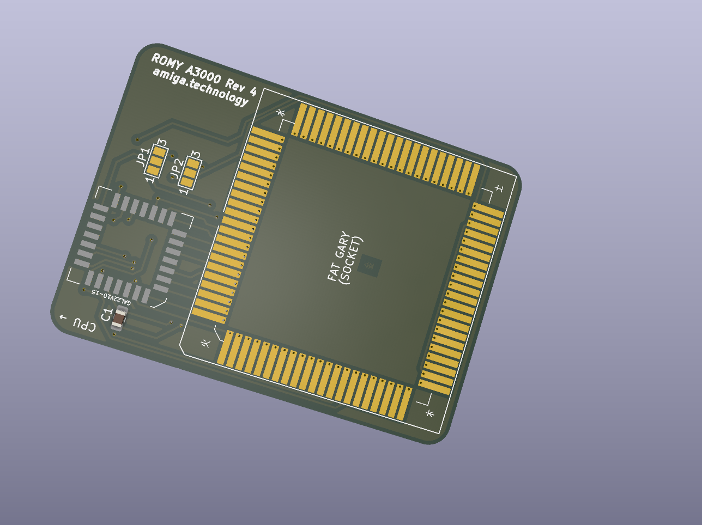
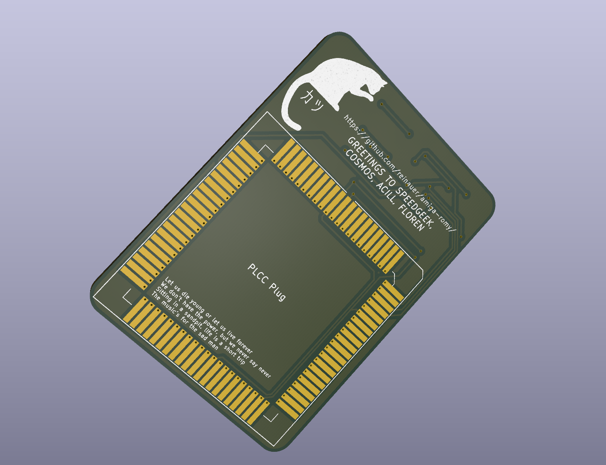
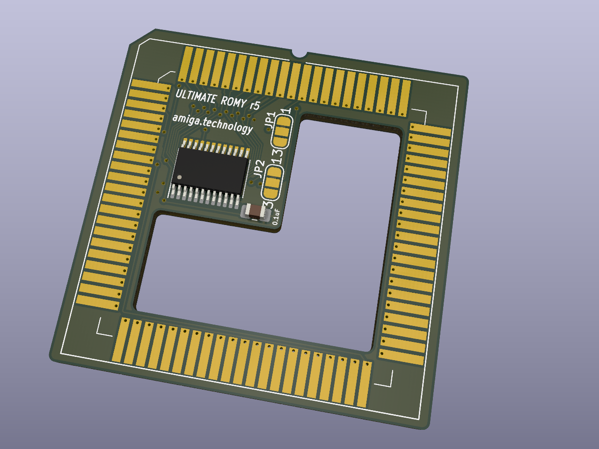
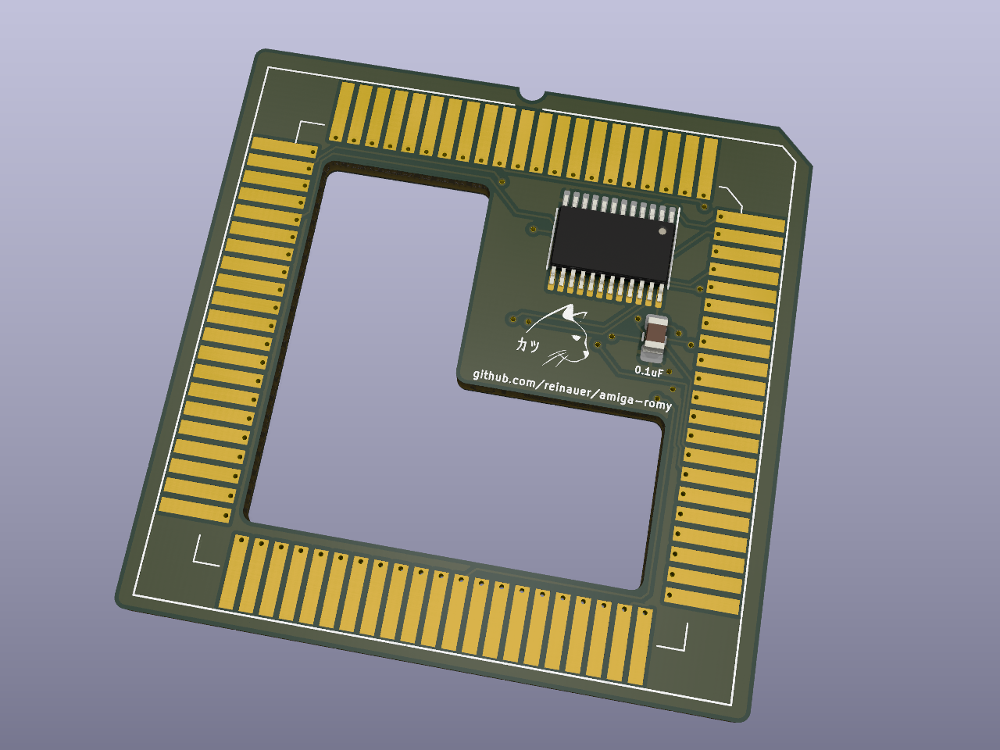

# Amiga Romy

ROMY is a small add-on PCB that enables Amiga 3000 / 4000 computers to use 1MB (or larger) Kickstart chips.

This project aims at iterating and improving the existing Romy designs.

# Hardware

In the `hardware` directory you will find the kicad schematics and PCB for the
latest versions of "my" ROMY:

## Amiga 4000 Romy

This version was the first one I made. It fits snugly on top of a soldered-down
Fat Agnus. The GAL is a PLCC-28 ATF22V10C type. This design is the most similar
to the original Romy.

## Amiga 3000 Romy

This version is a revamp of the A3000 Romy. On the A3000 Fat Agnus is socketed
using a through-hole PLCC-84 socket. Previous designs have required to unsolder
the socket, and solder a PCB between a socket and the mainboard, in some
variants adding a capacitor on the bottom of the mainboard.

This new design uses a PLCC-28 ATF22V10C GAL instead of the DIP version on
older Amiga 3000 designs. This is convenient because it lets you exchange GALs
between the A3000 and A4000 version.

To prevent having to solder on the A3000 board, I am using PLCC plugs (such as
the APW9328 from adapt-plus.com).

## Ultimate Romy

Now this gets exciting. PLCC parts are annoying to solder and fairly big. So I
skipped DIP and SOIC and went straight to the TSOP version of the ATF22V10C.
The small footprint of this part allows to create a single board for Amiga 3000
and Amiga 4000 machines.

* If you want to build an A4000 Romy with this design, put a PLCC84 socket on the
back of the PCB, and a capacitor and GAL on the front.
* To build the A3000 version, instead solder a PLCC-84 socket on the front of
the PCB, and solder the cap and GAL on the bottom. Then solder the PLCC plug
over the components.

This design is barely wider than Fat Agnus itself and adds the same
functionality as the other ROMYs with minimal impact.
**This design is untested**

# Logic

The `logic` directory contains the contents for the GAL.

# Software

Look in the `software` directory for a bunch of scripts to create a nice 1MB ROM
image for you.

# Credits

Romy has been developed in the past by speedgeek and Cosmos. Anton Gale kept
the designs alive on OSHPark. Thanks to John Floren for an amazing Amiga 3000,
and to Acill for patiently teaching soldering skills to firmware engineers like
me and for building an awesome community.

